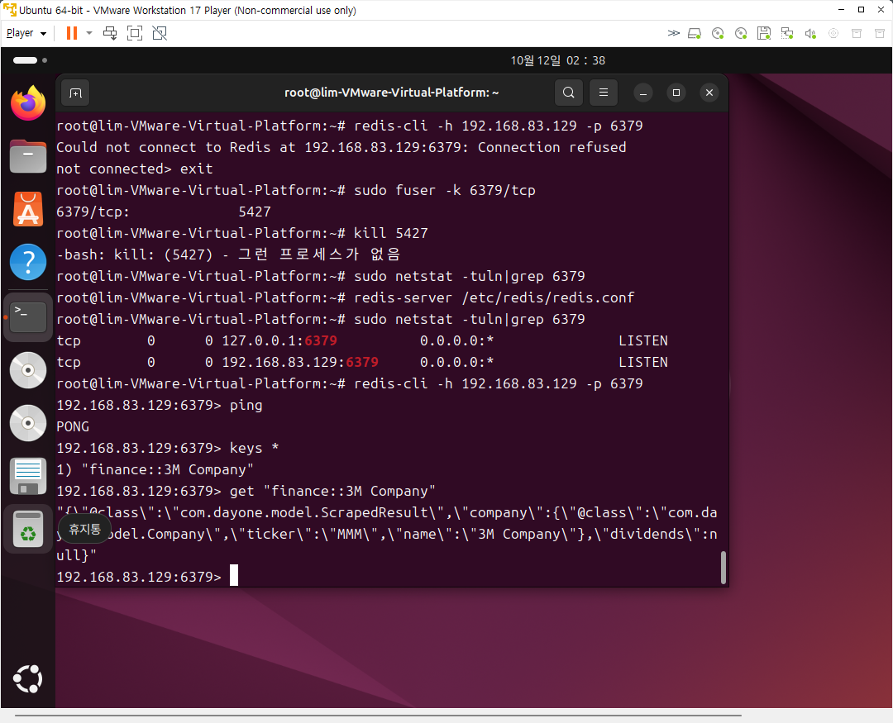
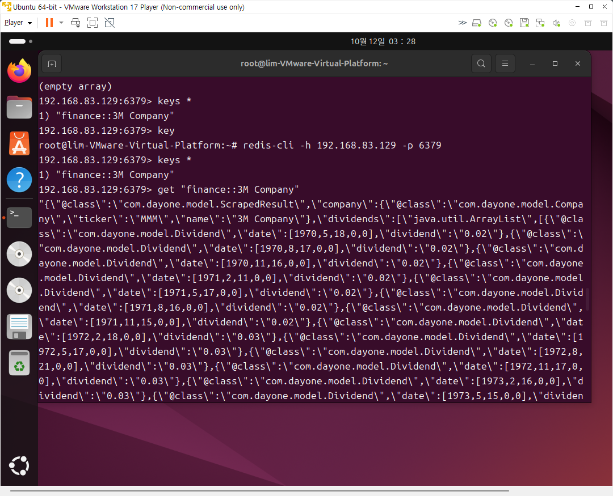
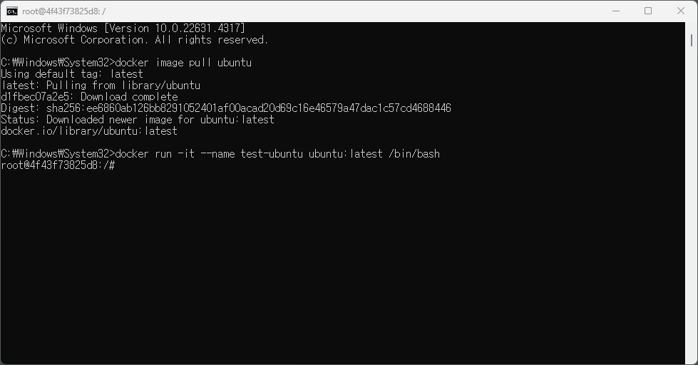

# StockDividend_hj

## 주식 배당금 서비스
- 미국 주식 배당금 정보를 제공하는 API 서비스를 개발합니다.
  -웹 페이지를 분석하고 스크래핑 기법을 활용하여 필요한 데이터를 추출/저장합니다.
  -사용자별 데이터를 관리하고 예상 배당금 액수를 계산할 수 있습니다.
  -서비스에서 캐시의 필요성을 이해하고 캐시 서버를 구성합니다.

### API 리스트
1. GET - finance/dividend/{companyName}
2. GET - company/autocomplete
3. GET - company
4. POST - company
5. DELETE - company/{ticker}
6. POST - auth/signup
7. POST - auth/signin

- spring boot 로 프로젝트 세팅하기 (완료)
- h2 인메모리 데이터베이스 연동하기 (완료)
- yahoo 파이낸스 데이터 스크래핑하기 (완료)
- DB table 모델링 및 연관관계 매핑하기 (완료)
- 스크래핑한 데이터를 적절한 형태로 DB 에 저장하기 (완료)
- POST /company API 구현 (완료)
- GET /finance/dividend/{companyName} API 구현 (완료)
- GET /company/autocomplete API 구현 (완료)
- GET /company API 구현 (완료)
- DELETE /company/{ticker} API 구현 (완료)
- 레디스 서버 구성하기 (완료)
- 레디스에 데이터 캐싱/삭제하기 (완료)
- 적합한 로그레벨로 필요한 로그 남기기 (완료)
- ControllerAdvice 에서 에러 처리하기 (완료)

